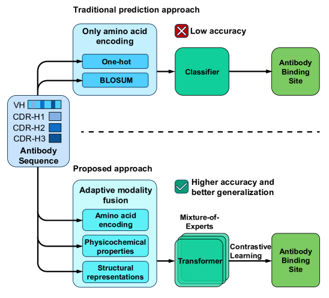

# CAME-AB: Enhanced Multi-Modal Transformer for Protein Classification

<div align="center">

[](https://www.python.org/downloads/)
[](https://pytorch.org/)
[](LICENSE)
[](https://arxiv.org/abs/2509.06465)



</div>

### 📌 Overview

**CAME-AB** is a state-of-the-art deep learning framework that revolutionizes antibody binding site prediction through intelligent multi-modal feature integration. Unlike traditional single-view approaches, CAME-AB uniquely combines five biologically grounded modalities with adaptive cross-modal reasoning to achieve unprecedented accuracy in predicting antibody-specific epitopes.

### 🎯 Key Innovations

- **Multi-Modal Integration**: Seamlessly fuses sequence, structural, and biochemical features through adaptive modality fusion
- **Mixture-of-Experts (MoE)**: Dynamic specialization across latent subspaces for enhanced feature discrimination  
- **Contrastive Learning**: Enforces intra-class compactness and inter-class separability in the embedding space
- **Superior Performance**: Consistently outperforms SOTA methods across multiple metrics (F1: 0.8185, MCC: 0.7134)

### 🏆 Why CAME-AB?

Traditional antibody binding site prediction methods face two critical limitations:
1. **Single-view features** fail to capture the complex interplay between sequence, structure, and biochemistry
2. **Generic epitope predictions** cannot identify antibody-specific binding sites

CAME-AB addresses both challenges by learning adaptive cross-modal representations that capture antibody-antigen interaction specificity, enabling precise therapeutic antibody design and immunological research.


## 🚀 Features

- **Multi-Modal Integration**: Combines 5 different protein representations:
  - ESMC (ESM-based embeddings)
  - ESMC Structure features
  - One-hot encoding
  - BLOSUM matrix features
  - GCN (Graph Convolutional Network) features

- **Advanced Architecture**:
  - Enhanced transformer with cross-modal attention
  - Gated fusion mechanisms
  - Shortcut-aware self-attention
  - Multi-task learning with auxiliary losses

- **Comprehensive Training Pipeline**:
  - Mixed precision training
  - Weighted sampling for imbalanced datasets
  - Mixup augmentation
  - Dynamic loss weighting
  - Early stopping with patience

## 📁 Project Structure

```
CAME-AB/
├── config/
│   └── config.yaml          # Main configuration file
├── src/
│   ├── data/               # Data loading and preprocessing
│   │   ├── __init__.py
│   │   └── dataloader.py
│   ├── models/             # Model architecture
│   │   ├── __init__.py
│   │   ├── attention.py    # Attention modules
│   │   ├── transformer.py  # Main transformer model
│   │   └── losses.py       # Loss functions
│   ├── training/           # Training utilities
│   │   ├── __init__.py
│   │   └── trainer.py
│   ├── evaluation/         # Evaluation metrics
│   │   ├── __init__.py
│   │   └── evaluator.py
│   ├── visualization/      # Plotting utilities
│   │   ├── __init__.py
│   │   └── visualizer.py
│   └── utils/              # Helper functions
│       ├── __init__.py
│       ├── config.py
│       └── helpers.py
├── notebooks/              # Jupyter notebooks for experiments
├── tests/                  # Unit tests
├── main.py                 # Main entry point
├── requirements.txt        # Python dependencies
└── README.md              # This file
```

## 🛠️ Installation

### Prerequisites
- Python 3.8+
- CUDA 11.0+ (for GPU support)

### Setup

1. Clone the repository:
```bash
git clone https://github.com/Recqvq/CAME-AB.git
cd CAME-AB
```

2. Create a virtual environment:
```bash
python -m venv venv
source venv/bin/activate  # On Windows: venv\Scripts\activate
```

3. Install dependencies:
```bash
pip install -r requirements.txt
```

## 📊 Data Preparation

The model expects preprocessed feature files in `.npy` format for each modality. Update the paths in `config/config.yaml`:

```yaml
paths:
  esmc:
    train_features: 'path/to/esmc_train_features.npy'
    train_labels: 'path/to/esmc_train_labels.npy'
    # ... other paths
```

### Expected Data Format

Each feature file should be a NumPy array with shape `(num_samples, feature_dim)`, where `feature_dim=256` for all modalities.

## 🚂 Training

### Basic Training

```bash
python main.py --config config/config.yaml --mode train
```

### Resume Training from Checkpoint

```bash
python main.py --config config/config.yaml --mode train --checkpoint models/checkpoint.pth
```

### Custom Configuration

```bash
python main.py --config config/custom_config.yaml --seed 123 --device cuda:1
```

## 📈 Evaluation

### Evaluate Trained Model

```bash
python main.py --config config/config.yaml --mode eval --checkpoint models/best_model.pth
```

### Train and Evaluate

```bash
python main.py --config config/config.yaml --mode both
```

## ⚙️ Configuration

Key configuration parameters in `config/config.yaml`:

### Model Parameters
- `embed_dim`: Embedding dimension (default: 256)
- `num_heads`: Number of attention heads (default: 8)
- `num_layers`: Number of transformer layers (default: 3)
- `dropout`: Dropout rate (default: 0.3)

### Training Parameters
- `batch_size`: Batch size (default: 64)
- `num_epochs`: Maximum epochs (default: 60)
- `learning_rate`: Initial learning rate (default: 0.0005)
- `patience`: Early stopping patience (default: 10)

### Loss Configuration
- `contrastive_weight`: Weight for contrastive loss (default: 0.2)
- `aux_weight`: Weight for auxiliary losses (default: 0.3)
- `temperature`: Temperature for contrastive loss (default: 0.07)

## 📉 Model Architecture

The model consists of several key components:

### 1. Cross-Modal Attention
Enables information exchange between different protein representations.

### 2. Gated Fusion
Adaptively weights contributions from different modalities based on input.

### 3. Multi-Task Learning
- Main classification task
- Auxiliary modality-specific classifications
- Contrastive learning objectives

<!-- ## 🔬 Experiments

### Running Experiments

1. **Hyperparameter Tuning**:
```python
# Use notebooks/hyperparameter_search.ipynb
```

2. **Cross-Validation**:
```python
# Modify main.py to include k-fold cross-validation
```

3. **Ablation Studies**:
```python
# Disable specific modalities in config.yaml
``` -->

## 📊 Results Visualization

The framework automatically generates:
- Training curves (loss, accuracy, F1 scores)
- Confusion matrices
- t-SNE feature visualizations
- Modality importance weights
- ROC curves

Visualizations are saved in the `visualizations/` directory.

<!-- ## 🤝 Contributing

Contributions are welcome! Please:

1. Fork the repository
2. Create a feature branch (`git checkout -b feature/amazing-feature`)
3. Commit changes (`git commit -m 'Add amazing feature'`)
4. Push to branch (`git push origin feature/amazing-feature`)
5. Open a Pull Request -->

## 📝 Citation

If you use this code in your research, please cite:

```bibtex
@misc{CAME,
  title={CAME-AB: Cross-Modality Attention with Mixture-of-Experts for Antibody Binding Site Prediction}, 
  author={Hongzong Li and Jiahao Ma and Zhanpeng Shi and Rui Xiao and Fanming Jin and Ye-Fan Hu and Hangjun Che and  Jian-Dong Huang},
  year={2025},
  eprint={2509.06465},
  archivePrefix={arXiv},
  primaryClass={cs.LG},
  url={https://arxiv.org/abs/2509.06465}, 
}
```

<!-- ## 📄 License

This project is licensed under the MIT License - see the LICENSE file for details. -->

## 🙏 Acknowledgments

We thank **HKU**, **ESM**, and **PyTorch**:  
- HKU for support and collaboration  
- ESM team for protein language models  
- PyTorch team for the deep learning framework  
## 📧 Contact

For questions or collaborations, please contact:
- Email: lihongzong@ust.hk

<!-- ## 🔍 Troubleshooting

### Common Issues

1. **CUDA Out of Memory**:
   - Reduce `batch_size` in config
   - Enable gradient accumulation
   - Use mixed precision training

2. **Slow Training**:
   - Increase `num_workers` in config
   - Enable `pin_memory` for GPU
   - Use SSD for data storage

3. **Poor Performance**:
   - Check data normalization
   - Adjust learning rate schedule
   - Increase model capacity (layers, dimensions) -->
